<div align="center">

<!-- Header élégant avec gradient -->


<!-- Badges élégants -->
<p>
  
  
  
<!--    -->
</p>

<!-- GIF subtil et moderne -->


</div>

---

## 👨‍💻 À propos


**Développeur Full-Stack** passionné par l'architecture logicielle et l'innovation technologique. Je conçois des solutions **robustes, sécurisées et évolutives**.

**Philosophie :** *Créer des applications qui ont du sens, avec une approche centrée utilisateur et une excellence technique.*

### 📬 Contact

<div align="center">
  
[](mailto:amethba8826@gmail.com)
[](https://www.linkedin.com/in/ameth-ba-2920b3253)
[](https://amethba.netlify.app/)
[](tel:+221781069049)

</div>

---

## 🛠️ Stack Technologique

<div align="center">

### Backend


### Frontend


### Databases & Tools


</div>

---

## 🚀 Projets Highlights

<table>
<tr>
<td width="50%">

### 🏟️ SenTerrain
*Plateforme de location de terrains*

**Tech:** C# • ASP.NET Core • PostgreSQL • JWT  
**Features:** Paiements intégrés, notifications SMS, gestion complète

</td>
<td width="50%">

### ✂️ Gestion Atelier Couture
*Système de gestion d'atelier*

**Tech:** C# • Twilio API • PostgreSQL  
**Features:** Commandes, clients, notifications automatisées

</td>
</tr>
<tr>
<td width="50%">

### 📦 NSA
*Gestion moderne des commandes*

**Tech:** Spring Boot • Angular • PostgreSQL  
**Features:** Interface moderne, API REST complète

</td>
<td width="50%">

### 💰 Gestion de Dettes
*Solution boutique complète*

**Tech:** PHP • MySQL • TailwindCSS  
**Features:** Suivi créances, reporting détaillé

</td>
</tr>
</table>

---

## 📊 GitHub Stats

<div align="center">


</div>

---

## 🏆 Expertise & Réalisations

<div align="center">

### 🎯 **Domaines d'Excellence**

<table>
<tr>
<td align="center" width="25%">

<br><strong>API Development</strong>
<br><small>REST • GraphQL • Microservices</small>
</td>
<td align="center" width="25%">

<br><strong>Database Design</strong>
<br><small>PostgreSQL • MySQL • Optimization</small>
</td>
<td align="center" width="25%">

<br><strong>Security</strong>
<br><small>JWT • Encryption • Best Practices</small>
</td>
<td align="center" width="25%">

<br><strong>Architecture</strong>
<br><small>MVC • Design Patterns • SOLID</small>
</td>
</tr>
</table>

</div>

### 💼 **Expérience Professionnelle**

```yaml
🎓 Formation:
  - Institut Supérieur de Management (ISM)
  - Génie Logiciel & Développement

💻 Spécialisations:
  - Développement Full-Stack (5+ ans)
  - Architecture logicielle
  - Intégration d'APIs tierces
  - Sécurisation d'applications

🌟 Réalisations:
  - 10+ projets complets développés
  - Intégrations paiement (Orange Money, Wave)
  - Systèmes de notifications (SMS, Email)
  - Tableaux de bord analytiques
```

---

## 🔥 Contributions & Activité

<div align="center">


### 📈 **Statistiques Détaillées**


[](https://git.io/streak-stats)

</div>

---

## 🎨 Showcase de Projets

<div align="center">

### 🌟 **Projets en Vedette**

</div>

#### 🏟️ **SenTerrain** - *Révolutionner la location de terrains*
> Une plateforme complète qui digitalise la gestion des terrains de sport au Sénégal

**🚀 Innovations:**
- Architecture microservices avec ASP.NET Core
- Intégration paiements mobiles (Orange Money, Wave)
- Système de réservation en temps réel
- Notifications SMS automatisées via Twilio

**📊 Impact:** 300+ utilisateurs actifs, 50+ terrains référencés

---

#### ✂️ **Atelier Couture Manager** - *Digitalisation de l'artisanat*
> Solution complète pour moderniser la gestion des ateliers de couture traditionnels

**🎯 Fonctionnalités:**
- Gestion clients et commandes
- Suivi production en temps réel  
- Facturation automatisée
- Reporting analytique avancé

**💡 Technologies:** C# • Entity Framework • PostgreSQL • Twilio API

---

#### 📦 **NSA Platform** - *E-commerce moderne*
> Plateforme e-commerce avec architecture Angular/Spring Boot

**⚡ Performances:**
- Interface responsive et moderne
- API REST sécurisée
- Gestion stock temps réel
- Dashboard analytique

---

## 🎯 Vision & Objectifs 2025

<div align="center">

### 🚀 **Roadmap Professionnelle**

```mermaid
graph LR
    A[🎯 Équipe Tech] --> B[🏗️ Architecture]
    B --> C[📚 Open Source]
    C --> D[🌟 Mentoring]
    D --> E[🤖 IA & Innovation]
    
    style A fill:#ff6b6b
    style B fill:#4ecdc4
    style C fill:#45b7d1
    style D fill:#f9ca24
    style E fill:#6c5ce7
```



**Ambitions 2025:**
- Rejoindre une équipe tech innovante et ambitieuse
- Architecturer des solutions robustes à grande échelle
- Contribuer activement à des projets open source
- Mentorer de jeunes développeurs
- Explorer l'IA et les technologies émergentes

</div>

---


## 🚀 Prêt pour le prochain défi ?

<div align="center">

### 🤝 **Collaborons ensemble !**

*Je suis passionné par les projets innovants et les défis techniques stimulants.*  
*Discutons de votre vision et créons quelque chose d'extraordinaire !*

<br>

**📧 Contact Direct**  
[](mailto:amethba8826@gmail.com)

**📞 Appel/WhatsApp**  
[](tel:+221781069049)

**🌐 Portfolio**  
[](https://amethba.netlify.app/)

<br>

---


*Merci de visiter mon profil ! ⭐ N'hésitez pas à explorer mes projets et à me contacter.*

<!-- Footer moderne avec animation -->


</div>
